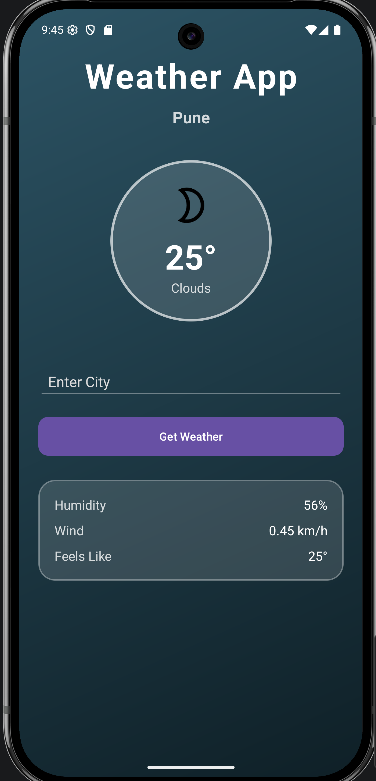
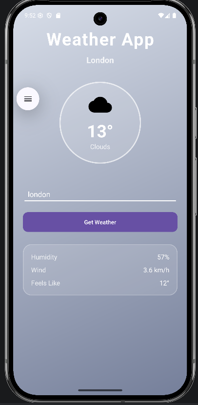
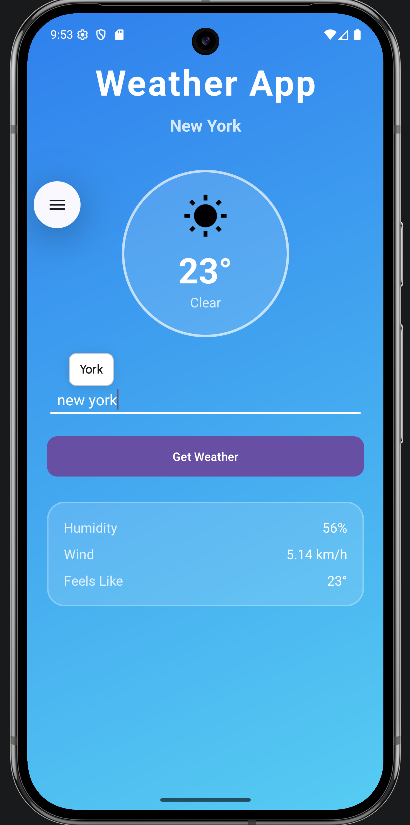

# 🌦️ Weather App (Android)

A modern Android weather application built using Kotlin that provides real-time weather updates for any city using API integration.

---

## 🚀 Features

* 🌍 Search weather by city name
* 🌡️ Real-time temperature updates
* ☁️ Dynamic weather conditions (Cloudy, Sunny, Rainy, etc.)
* 🌙 Day & Night UI handling
* 🎨 Weather-based icons and UI
* 📱 Clean and responsive design

---

## 🛠️ Tech Stack

* **Language:** Kotlin
* **UI:** XML
* **API:** Weather API (REST)
* **Networking:** Retrofit / HTTP
* **IDE:** Android Studio

---

## 🔌 How API Works

This app fetches real-time weather data using a REST API.

### Flow:

1. User enters city name
2. App sends request to weather API
3. API returns JSON data
4. App parses JSON
5. UI updates with temperature, condition, and icon

### Example API Response:

```json
{
  "location": {
    "name": "Pune"
  },
  "current": {
    "temp_c": 28,
    "condition": {
      "text": "Cloudy"
    }
  }
}
```

---

## 📸 Screenshots

### 🏠 Home Screen (Default weahter of my current location)


### ☁️ Cloudy Weather


### ☀️ Sunny Mode


---

## ⚙️ Installation

1. Clone the repository

```bash
git clone https://github.com/your-username/Weather-App-Android.git
```

2. Open in Android Studio
3. Add your API key
4. Run the app 🚀

---

## 🎯 Future Improvements

* 📍 Auto location detection (GPS)
* 🔔 Weather alerts
* 📊 Weekly forecast
* 🌐 Multi-language support

---

## 👨‍💻 Author

* Mandeep Singh

---

## ⭐ If you like this project

Give it a star ⭐ on GitHub!
